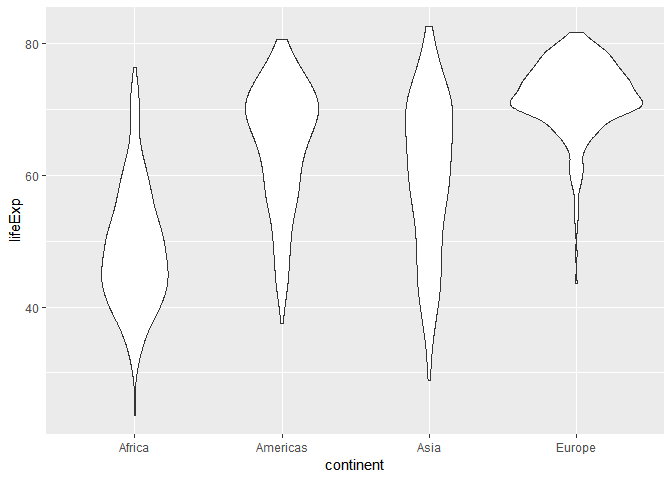
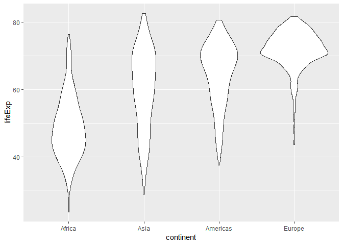
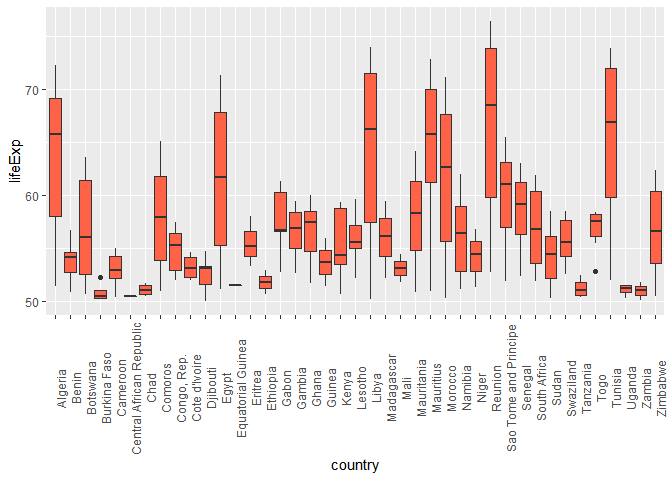
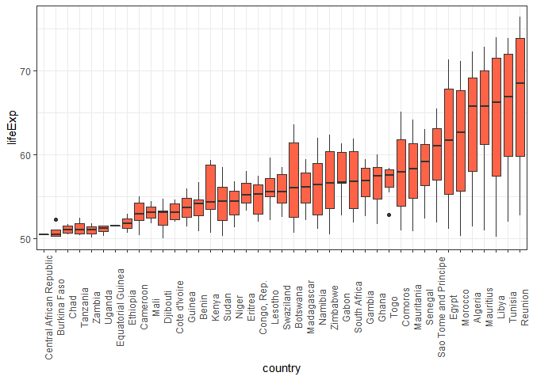

hw05
================

I will be working with the gapminder data.

``` r
library(gapminder)
suppressPackageStartupMessages(library(tidyverse))
suppressPackageStartupMessages(library(ggplot2))
suppressPackageStartupMessages(library(forcats))
```

## Activity01

First I will look at the structure of the gapminder data set to get an
idea of levels

``` r
gapminder %>% 
  str()
```

    ## Classes 'tbl_df', 'tbl' and 'data.frame':    1704 obs. of  6 variables:
    ##  $ country  : Factor w/ 142 levels "Afghanistan",..: 1 1 1 1 1 1 1 1 1 1 ...
    ##  $ continent: Factor w/ 5 levels "Africa","Americas",..: 3 3 3 3 3 3 3 3 3 3 ...
    ##  $ year     : int  1952 1957 1962 1967 1972 1977 1982 1987 1992 1997 ...
    ##  $ lifeExp  : num  28.8 30.3 32 34 36.1 ...
    ##  $ pop      : int  8425333 9240934 10267083 11537966 13079460 14880372 12881816 13867957 16317921 22227415 ...
    ##  $ gdpPercap: num  779 821 853 836 740 ...

``` r
gapminder  
```

    ## # A tibble: 1,704 x 6
    ##    country     continent  year lifeExp      pop gdpPercap
    ##    <fct>       <fct>     <int>   <dbl>    <int>     <dbl>
    ##  1 Afghanistan Asia       1952    28.8  8425333      779.
    ##  2 Afghanistan Asia       1957    30.3  9240934      821.
    ##  3 Afghanistan Asia       1962    32.0 10267083      853.
    ##  4 Afghanistan Asia       1967    34.0 11537966      836.
    ##  5 Afghanistan Asia       1972    36.1 13079460      740.
    ##  6 Afghanistan Asia       1977    38.4 14880372      786.
    ##  7 Afghanistan Asia       1982    39.9 12881816      978.
    ##  8 Afghanistan Asia       1987    40.8 13867957      852.
    ##  9 Afghanistan Asia       1992    41.7 16317921      649.
    ## 10 Afghanistan Asia       1997    41.8 22227415      635.
    ## # ... with 1,694 more rows

How many levels for continent? and what are the levels?

``` r
nlevels(gapminder$continent)
```

    ## [1] 5

``` r
levels(gapminder$continent)
```

    ## [1] "Africa"   "Americas" "Asia"     "Europe"   "Oceania"

There are 5 levels; Africa, Americas, Asia, Europe, Oceania

I’m going to drop levels of Oceania and check the number of levels

``` r
gap_OC <- gapminder %>% 
  filter(continent != c("Oceania"))

gap_OC %>% 
  droplevels() %>% 
  str()
```

    ## Classes 'tbl_df', 'tbl' and 'data.frame':    1680 obs. of  6 variables:
    ##  $ country  : Factor w/ 140 levels "Afghanistan",..: 1 1 1 1 1 1 1 1 1 1 ...
    ##  $ continent: Factor w/ 4 levels "Africa","Americas",..: 3 3 3 3 3 3 3 3 3 3 ...
    ##  $ year     : int  1952 1957 1962 1967 1972 1977 1982 1987 1992 1997 ...
    ##  $ lifeExp  : num  28.8 30.3 32 34 36.1 ...
    ##  $ pop      : int  8425333 9240934 10267083 11537966 13079460 14880372 12881816 13867957 16317921 22227415 ...
    ##  $ gdpPercap: num  779 821 853 836 740 ...

``` r
gap_OC
```

    ## # A tibble: 1,680 x 6
    ##    country     continent  year lifeExp      pop gdpPercap
    ##    <fct>       <fct>     <int>   <dbl>    <int>     <dbl>
    ##  1 Afghanistan Asia       1952    28.8  8425333      779.
    ##  2 Afghanistan Asia       1957    30.3  9240934      821.
    ##  3 Afghanistan Asia       1962    32.0 10267083      853.
    ##  4 Afghanistan Asia       1967    34.0 11537966      836.
    ##  5 Afghanistan Asia       1972    36.1 13079460      740.
    ##  6 Afghanistan Asia       1977    38.4 14880372      786.
    ##  7 Afghanistan Asia       1982    39.9 12881816      978.
    ##  8 Afghanistan Asia       1987    40.8 13867957      852.
    ##  9 Afghanistan Asia       1992    41.7 16317921      649.
    ## 10 Afghanistan Asia       1997    41.8 22227415      635.
    ## # ... with 1,670 more rows

I now only have 4 levels for continent. I also only have 1,680 rows
instead of 1704. Now I will re-plot the data to get a better
visualization

``` r
gap_OC %>% 
  ggplot(aes(continent, lifeExp)) +
  geom_violin()
```

<!-- -->

I will re-order the data based on an important factor. To get an idea of
what to reorder by I will first do summary stats

``` r
summary(gap_OC)
```

    ##         country        continent        year         lifeExp     
    ##  Afghanistan:  12   Africa  :624   Min.   :1952   Min.   :23.60  
    ##  Albania    :  12   Americas:300   1st Qu.:1966   1st Qu.:48.08  
    ##  Algeria    :  12   Asia    :396   Median :1980   Median :60.34  
    ##  Angola     :  12   Europe  :360   Mean   :1980   Mean   :59.26  
    ##  Argentina  :  12   Oceania :  0   3rd Qu.:1993   3rd Qu.:70.75  
    ##  Austria    :  12                  Max.   :2007   Max.   :82.60  
    ##  (Other)    :1608                                                
    ##       pop              gdpPercap       
    ##  Min.   :6.001e+04   Min.   :   241.2  
    ##  1st Qu.:2.780e+06   1st Qu.:  1189.1  
    ##  Median :7.024e+06   Median :  3449.5  
    ##  Mean   :2.990e+07   Mean   :  7052.4  
    ##  3rd Qu.:1.987e+07   3rd Qu.:  8943.2  
    ##  Max.   :1.319e+09   Max.   :113523.1  
    ## 

I will reorder based on min LifeExp to visualize a trend.

``` r
gap_OC %>% 
  mutate(continent = fct_reorder(continent, lifeExp, fun = min("lifeExp"))) %>% 
  ggplot(aes(continent, lifeExp)) +
  geom_violin()
```

<!-- --> Asia and America have
now switched. Now that it is ordered by an important variable such as
min LifeExp, the plot is more meaningful.

I will try the arrange function with this data set to see if it can
accomplish the same effect.

``` r
arrange(gap_OC, desc(lifeExp)) %>% 
  ggplot(aes(continent, lifeExp)) +
  geom_violin()
```

<!-- -->

If I arrange by descending life expectancy the figure does not change.
But I will see if the data is arranged differently.

``` r
arr_gap_OC <- arrange(gap_OC, desc(lifeExp))

arr_gap_OC
```

    ## # A tibble: 1,680 x 6
    ##    country          continent  year lifeExp       pop gdpPercap
    ##    <fct>            <fct>     <int>   <dbl>     <int>     <dbl>
    ##  1 Japan            Asia       2007    82.6 127467972    31656.
    ##  2 Hong Kong, China Asia       2007    82.2   6980412    39725.
    ##  3 Japan            Asia       2002    82   127065841    28605.
    ##  4 Iceland          Europe     2007    81.8    301931    36181.
    ##  5 Switzerland      Europe     2007    81.7   7554661    37506.
    ##  6 Hong Kong, China Asia       2002    81.5   6762476    30209.
    ##  7 Spain            Europe     2007    80.9  40448191    28821.
    ##  8 Sweden           Europe     2007    80.9   9031088    33860.
    ##  9 Israel           Asia       2007    80.7   6426679    25523.
    ## 10 Japan            Asia       1997    80.7 125956499    28817.
    ## # ... with 1,670 more rows

And I see that the data has been arragned based on descending life
expectancy

## Activity02

Now I will experiment with reading and writing to csv

First I will create a data frame that I want to work with. To make this
easy to notice changes etc… I will create a small data from from the
gapminder set that just includes data for Canada and Egypt

``` r
gap_CE <- gapminder %>% filter(country %in% c("Canada", "Egypt")) %>% 
  droplevels()
```

I’m going to start by just writing this to .csv

``` r
write.csv(gap_CE)
```

    ## "","country","continent","year","lifeExp","pop","gdpPercap"
    ## "1","Canada","Americas",1952,68.75,14785584,11367.16112
    ## "2","Canada","Americas",1957,69.96,17010154,12489.95006
    ## "3","Canada","Americas",1962,71.3,18985849,13462.48555
    ## "4","Canada","Americas",1967,72.13,20819767,16076.58803
    ## "5","Canada","Americas",1972,72.88,22284500,18970.57086
    ## "6","Canada","Americas",1977,74.21,23796400,22090.88306
    ## "7","Canada","Americas",1982,75.76,25201900,22898.79214
    ## "8","Canada","Americas",1987,76.86,26549700,26626.51503
    ## "9","Canada","Americas",1992,77.95,28523502,26342.88426
    ## "10","Canada","Americas",1997,78.61,30305843,28954.92589
    ## "11","Canada","Americas",2002,79.77,31902268,33328.96507
    ## "12","Canada","Americas",2007,80.653,33390141,36319.23501
    ## "13","Egypt","Africa",1952,41.893,22223309,1418.822445
    ## "14","Egypt","Africa",1957,44.444,25009741,1458.915272
    ## "15","Egypt","Africa",1962,46.992,28173309,1693.335853
    ## "16","Egypt","Africa",1967,49.293,31681188,1814.880728
    ## "17","Egypt","Africa",1972,51.137,34807417,2024.008147
    ## "18","Egypt","Africa",1977,53.319,38783863,2785.493582
    ## "19","Egypt","Africa",1982,56.006,45681811,3503.729636
    ## "20","Egypt","Africa",1987,59.797,52799062,3885.46071
    ## "21","Egypt","Africa",1992,63.674,59402198,3794.755195
    ## "22","Egypt","Africa",1997,67.217,66134291,4173.181797
    ## "23","Egypt","Africa",2002,69.806,73312559,4754.604414
    ## "24","Egypt","Africa",2007,71.338,80264543,5581.180998

It’s nice to see the data here but I also want to create a file.

``` r
write.csv(gap_CE, file = "gap_CE.csv")
```

Now I will rearrange the data to see if it will save.

``` r
gap_CE %>% arrange(desc(country))
```

    ## # A tibble: 24 x 6
    ##    country continent  year lifeExp      pop gdpPercap
    ##    <fct>   <fct>     <int>   <dbl>    <int>     <dbl>
    ##  1 Egypt   Africa     1952    41.9 22223309     1419.
    ##  2 Egypt   Africa     1957    44.4 25009741     1459.
    ##  3 Egypt   Africa     1962    47.0 28173309     1693.
    ##  4 Egypt   Africa     1967    49.3 31681188     1815.
    ##  5 Egypt   Africa     1972    51.1 34807417     2024.
    ##  6 Egypt   Africa     1977    53.3 38783863     2785.
    ##  7 Egypt   Africa     1982    56.0 45681811     3504.
    ##  8 Egypt   Africa     1987    59.8 52799062     3885.
    ##  9 Egypt   Africa     1992    63.7 59402198     3795.
    ## 10 Egypt   Africa     1997    67.2 66134291     4173.
    ## # ... with 14 more rows

``` r
write.csv(gap_CE %>% arrange(desc(country)))
```

    ## "","country","continent","year","lifeExp","pop","gdpPercap"
    ## "1","Egypt","Africa",1952,41.893,22223309,1418.822445
    ## "2","Egypt","Africa",1957,44.444,25009741,1458.915272
    ## "3","Egypt","Africa",1962,46.992,28173309,1693.335853
    ## "4","Egypt","Africa",1967,49.293,31681188,1814.880728
    ## "5","Egypt","Africa",1972,51.137,34807417,2024.008147
    ## "6","Egypt","Africa",1977,53.319,38783863,2785.493582
    ## "7","Egypt","Africa",1982,56.006,45681811,3503.729636
    ## "8","Egypt","Africa",1987,59.797,52799062,3885.46071
    ## "9","Egypt","Africa",1992,63.674,59402198,3794.755195
    ## "10","Egypt","Africa",1997,67.217,66134291,4173.181797
    ## "11","Egypt","Africa",2002,69.806,73312559,4754.604414
    ## "12","Egypt","Africa",2007,71.338,80264543,5581.180998
    ## "13","Canada","Americas",1952,68.75,14785584,11367.16112
    ## "14","Canada","Americas",1957,69.96,17010154,12489.95006
    ## "15","Canada","Americas",1962,71.3,18985849,13462.48555
    ## "16","Canada","Americas",1967,72.13,20819767,16076.58803
    ## "17","Canada","Americas",1972,72.88,22284500,18970.57086
    ## "18","Canada","Americas",1977,74.21,23796400,22090.88306
    ## "19","Canada","Americas",1982,75.76,25201900,22898.79214
    ## "20","Canada","Americas",1987,76.86,26549700,26626.51503
    ## "21","Canada","Americas",1992,77.95,28523502,26342.88426
    ## "22","Canada","Americas",1997,78.61,30305843,28954.92589
    ## "23","Canada","Americas",2002,79.77,31902268,33328.96507
    ## "24","Canada","Americas",2007,80.653,33390141,36319.23501

## Actvity 03

Here is one of the first figures I made in this course:

``` r
##code taken from previous hw03

Africa <- gapminder %>% 
  filter(lifeExp > 50) %>% 
  filter(continent == "Africa")
Africa %>% 
  ggplot(aes(country,lifeExp)) +
  geom_boxplot(fill="tomato") +
  theme(axis.text.x=element_text(angle=90))
```

<!-- -->

First I will reorder based on the variable lifeExp so that the trend is
easier to visualize.

``` r
Africa %>%
  mutate(country = fct_reorder(country, lifeExp, fun = min("lifeExp"))) %>% 
  ggplot(aes(country,lifeExp)) +
  geom_boxplot(fill = "tomato") +
  theme_bw() +
  theme(axis.text.x=element_text(angle=90))
```

<!-- -->

The color in this graph is meaningless. I will color by countries that
have a mean life expectancy greater than 60. Since there are multiple
points per country I will group first and then take mean
lifeExp.

``` r
mean_lifeExp <- Africa %>% group_by(country)%>% summarise(mle = mean(lifeExp)) %>% filter(mle>60)
lapply(mean_lifeExp$country,as.character)
```

    ## [[1]]
    ## [1] "Algeria"
    ## 
    ## [[2]]
    ## [1] "Egypt"
    ## 
    ## [[3]]
    ## [1] "Libya"
    ## 
    ## [[4]]
    ## [1] "Mauritius"
    ## 
    ## [[5]]
    ## [1] "Morocco"
    ## 
    ## [[6]]
    ## [1] "Reunion"
    ## 
    ## [[7]]
    ## [1] "Tunisia"

Now that I have the data in the right format I can color it the way I
want
to.

``` r
##assinging variable for filtered data that is ordered the by min lifeExp
Africa_LifeExp <- Africa %>%
  mutate(country = fct_reorder(country, lifeExp, fun = min("lifeExp"))) %>% 
  mutate(meanOver60 = if_else(country %in% lapply(mean_lifeExp$country,as.character), "high", "low")) 

##
Africa_Plot<- Africa_LifeExp %>% 
  ggplot(aes(country,lifeExp, fill=meanOver60)) +
  geom_boxplot() +
  theme_bw() +
  theme(axis.text.x=element_text(angle=90)) 
```

Now I will create it as a plotly plot

``` r
library(plotly)
```

    ## 
    ## Attaching package: 'plotly'

    ## The following object is masked from 'package:ggplot2':
    ## 
    ##     last_plot

    ## The following object is masked from 'package:stats':
    ## 
    ##     filter

    ## The following object is masked from 'package:graphics':
    ## 
    ##     layout

``` r
Africa_Plot %>% 
  ggplotly()
```

<!--html_preserve-->

<div id="htmlwidget-f53edd138d3a40c70367" class="plotly html-widget" style="width:672px;height:480px;">

</div>

<script type="application/json" data-for="htmlwidget-f53edd138d3a40c70367">{"x":{"data":[{"x":[37,37,37,37,37,37,37,37,37,35,35,35,35,35,35,35,35,39,39,39,39,39,39,39,39,39,38,38,38,38,38,38,38,38,38,38,38,38,36,36,36,36,36,36,36,36,36,41,41,41,41,41,41,41,41,41,41,41,41,40,40,40,40,40,40,40,40,40],"y":[51.407,54.518,58.014,61.368,65.799,67.744,69.152,70.994,72.301,51.137,53.319,56.006,59.797,63.674,67.217,69.806,71.338,50.227,52.773,57.442,62.155,66.234,68.755,71.555,72.737,73.952,50.986,58.089,60.246,61.557,62.944,64.93,66.711,68.74,69.745,70.736,71.954,72.801,50.335,52.862,55.73,59.65,62.677,65.393,67.66,69.615,71.164,52.724,55.09,57.666,60.542,64.274,67.064,69.885,71.913,73.615,74.772,75.744,76.442,52.053,55.602,59.837,64.048,66.894,70.001,71.973,73.042,73.923],"hoverinfo":"y","type":"box","fillcolor":"rgba(248,118,109,1)","marker":{"opacity":null,"outliercolor":"rgba(0,0,0,1)","line":{"width":1.88976377952756,"color":"rgba(0,0,0,1)"},"size":5.66929133858268},"line":{"color":"rgba(51,51,51,1)","width":1.88976377952756},"name":"high","legendgroup":"high","showlegend":true,"xaxis":"x","yaxis":"y","frame":null},{"x":[14,14,14,14,14,14,22,22,22,22,22,22,22,22,22,2,2,2,2,9,9,9,9,9,1,3,3,3,3,3,31,31,31,31,31,31,31,19,19,19,19,19,19,19,19,19,12,12,12,12,11,11,11,11,11,7,18,18,18,8,8,26,26,26,26,26,26,26,28,28,28,28,29,29,29,29,29,29,29,13,13,13,15,15,15,15,15,15,15,15,15,20,20,20,20,20,23,23,23,23,10,10,32,32,32,32,32,32,32,24,24,24,24,24,24,24,24,24,17,17,17,34,34,34,34,34,34,34,34,34,34,33,33,33,33,33,33,27,27,27,27,27,27,27,27,16,16,16,16,16,16,21,21,21,21,21,4,4,4,4,30,30,30,30,30,30,30,6,6,6,6,5,5,5,5,25,25,25,25,25,25,25,25],"y":[50.904,52.337,53.919,54.777,54.406,56.728,51.52,53.298,56.024,59.319,61.484,63.622,62.745,52.556,50.728,50.26,50.324,50.65,52.295,52.961,54.985,54.314,52.199,50.43,50.485,51.051,51.724,51.573,50.525,50.651,50.939,52.933,54.926,57.939,60.66,62.974,65.152,52.04,54.907,55.625,56.695,57.47,56.433,52.962,52.97,55.322,52.374,53.983,54.655,52.044,50.04,51.604,53.157,53.373,54.791,51.579,53.378,55.24,58.04,50.725,52.947,52.79,56.564,60.19,61.366,60.461,56.761,56.735,52.644,55.861,58.041,59.448,51.756,53.744,55.729,57.501,58.556,58.453,60.022,51.455,53.676,56.007,50.654,53.559,56.155,58.766,59.339,59.285,54.407,50.992,54.11,52.208,55.078,57.18,59.685,55.558,52.214,54.978,57.286,59.443,51.818,54.467,50.852,53.599,56.145,58.333,60.43,62.247,64.164,51.159,53.867,56.437,58.968,60.835,61.999,58.909,51.479,52.906,51.313,54.496,56.867,51.893,54.425,56.48,58.55,60.351,61.728,62.742,63.306,64.337,65.528,52.379,55.769,58.196,60.187,61.6,63.062,51.927,53.696,55.527,58.161,60.834,61.888,60.236,53.365,50.338,51.744,53.556,55.373,56.369,58.556,52.537,55.561,57.678,58.474,54.289,50.608,51.535,50.44,52.517,52.887,55.471,56.941,58.061,58.39,57.561,58.42,51.016,50.35,51.509,51.542,50.107,51.386,51.821,50.821,50.469,52.358,53.995,55.635,57.674,60.363,62.351,60.377],"hoverinfo":"y","type":"box","fillcolor":"rgba(0,191,196,1)","marker":{"opacity":null,"outliercolor":"rgba(0,0,0,1)","line":{"width":1.88976377952756,"color":"rgba(0,0,0,1)"},"size":5.66929133858268},"line":{"color":"rgba(51,51,51,1)","width":1.88976377952756},"name":"low","legendgroup":"low","showlegend":true,"xaxis":"x","yaxis":"y","frame":null}],"layout":{"margin":{"t":26.2283105022831,"r":7.30593607305936,"b":168.767123287671,"l":37.2602739726027},"plot_bgcolor":"rgba(255,255,255,1)","paper_bgcolor":"rgba(255,255,255,1)","font":{"color":"rgba(0,0,0,1)","family":"","size":14.6118721461187},"xaxis":{"domain":[0,1],"automargin":true,"type":"linear","autorange":false,"range":[0.4,41.6],"tickmode":"array","ticktext":["Central African Republic","Burkina Faso","Chad","Tanzania","Zambia","Uganda","Equatorial Guinea","Ethiopia","Cameroon","Mali","Djibouti","Cote d'Ivoire","Guinea","Benin","Kenya","Sudan","Niger","Eritrea","Congo, Rep.","Lesotho","Swaziland","Botswana","Madagascar","Namibia","Zimbabwe","Gabon","South Africa","Gambia","Ghana","Togo","Comoros","Mauritania","Senegal","Sao Tome and Principe","Egypt","Morocco","Algeria","Mauritius","Libya","Tunisia","Reunion"],"tickvals":[1,2,3,4,5,6,7,8,9,10,11,12,13,14,15,16,17,18,19,20,21,22,23,24,25,26,27,28,29,30,31,32,33,34,35,36,37,38,39,40,41],"categoryorder":"array","categoryarray":["Central African Republic","Burkina Faso","Chad","Tanzania","Zambia","Uganda","Equatorial Guinea","Ethiopia","Cameroon","Mali","Djibouti","Cote d'Ivoire","Guinea","Benin","Kenya","Sudan","Niger","Eritrea","Congo, Rep.","Lesotho","Swaziland","Botswana","Madagascar","Namibia","Zimbabwe","Gabon","South Africa","Gambia","Ghana","Togo","Comoros","Mauritania","Senegal","Sao Tome and Principe","Egypt","Morocco","Algeria","Mauritius","Libya","Tunisia","Reunion"],"nticks":null,"ticks":"outside","tickcolor":"rgba(51,51,51,1)","ticklen":3.65296803652968,"tickwidth":0.66417600664176,"showticklabels":true,"tickfont":{"color":"rgba(77,77,77,1)","family":"","size":11.689497716895},"tickangle":-90,"showline":false,"linecolor":null,"linewidth":0,"showgrid":true,"gridcolor":"rgba(235,235,235,1)","gridwidth":0.66417600664176,"zeroline":false,"anchor":"y","title":"country","titlefont":{"color":"rgba(0,0,0,1)","family":"","size":14.6118721461187},"hoverformat":".2f"},"yaxis":{"domain":[0,1],"automargin":true,"type":"linear","autorange":false,"range":[48.7199,77.7621],"tickmode":"array","ticktext":["50","60","70"],"tickvals":[50,60,70],"categoryorder":"array","categoryarray":["50","60","70"],"nticks":null,"ticks":"outside","tickcolor":"rgba(51,51,51,1)","ticklen":3.65296803652968,"tickwidth":0.66417600664176,"showticklabels":true,"tickfont":{"color":"rgba(77,77,77,1)","family":"","size":11.689497716895},"tickangle":-0,"showline":false,"linecolor":null,"linewidth":0,"showgrid":true,"gridcolor":"rgba(235,235,235,1)","gridwidth":0.66417600664176,"zeroline":false,"anchor":"x","title":"lifeExp","titlefont":{"color":"rgba(0,0,0,1)","family":"","size":14.6118721461187},"hoverformat":".2f"},"shapes":[{"type":"rect","fillcolor":"transparent","line":{"color":"rgba(51,51,51,1)","width":0.66417600664176,"linetype":"solid"},"yref":"paper","xref":"paper","x0":0,"x1":1,"y0":0,"y1":1}],"showlegend":true,"legend":{"bgcolor":"rgba(255,255,255,1)","bordercolor":"transparent","borderwidth":1.88976377952756,"font":{"color":"rgba(0,0,0,1)","family":"","size":11.689497716895},"y":0.93503937007874},"annotations":[{"text":"meanOver60","x":1.02,"y":1,"showarrow":false,"ax":0,"ay":0,"font":{"color":"rgba(0,0,0,1)","family":"","size":14.6118721461187},"xref":"paper","yref":"paper","textangle":-0,"xanchor":"left","yanchor":"bottom","legendTitle":true}],"hovermode":"closest","barmode":"relative"},"config":{"doubleClick":"reset","modeBarButtonsToAdd":[{"name":"Collaborate","icon":{"width":1000,"ascent":500,"descent":-50,"path":"M487 375c7-10 9-23 5-36l-79-259c-3-12-11-23-22-31-11-8-22-12-35-12l-263 0c-15 0-29 5-43 15-13 10-23 23-28 37-5 13-5 25-1 37 0 0 0 3 1 7 1 5 1 8 1 11 0 2 0 4-1 6 0 3-1 5-1 6 1 2 2 4 3 6 1 2 2 4 4 6 2 3 4 5 5 7 5 7 9 16 13 26 4 10 7 19 9 26 0 2 0 5 0 9-1 4-1 6 0 8 0 2 2 5 4 8 3 3 5 5 5 7 4 6 8 15 12 26 4 11 7 19 7 26 1 1 0 4 0 9-1 4-1 7 0 8 1 2 3 5 6 8 4 4 6 6 6 7 4 5 8 13 13 24 4 11 7 20 7 28 1 1 0 4 0 7-1 3-1 6-1 7 0 2 1 4 3 6 1 1 3 4 5 6 2 3 3 5 5 6 1 2 3 5 4 9 2 3 3 7 5 10 1 3 2 6 4 10 2 4 4 7 6 9 2 3 4 5 7 7 3 2 7 3 11 3 3 0 8 0 13-1l0-1c7 2 12 2 14 2l218 0c14 0 25-5 32-16 8-10 10-23 6-37l-79-259c-7-22-13-37-20-43-7-7-19-10-37-10l-248 0c-5 0-9-2-11-5-2-3-2-7 0-12 4-13 18-20 41-20l264 0c5 0 10 2 16 5 5 3 8 6 10 11l85 282c2 5 2 10 2 17 7-3 13-7 17-13z m-304 0c-1-3-1-5 0-7 1-1 3-2 6-2l174 0c2 0 4 1 7 2 2 2 4 4 5 7l6 18c0 3 0 5-1 7-1 1-3 2-6 2l-173 0c-3 0-5-1-8-2-2-2-4-4-4-7z m-24-73c-1-3-1-5 0-7 2-2 3-2 6-2l174 0c2 0 5 0 7 2 3 2 4 4 5 7l6 18c1 2 0 5-1 6-1 2-3 3-5 3l-174 0c-3 0-5-1-7-3-3-1-4-4-5-6z"},"click":"function(gd) { \n        // is this being viewed in RStudio?\n        if (location.search == '?viewer_pane=1') {\n          alert('To learn about plotly for collaboration, visit:\\n https://cpsievert.github.io/plotly_book/plot-ly-for-collaboration.html');\n        } else {\n          window.open('https://cpsievert.github.io/plotly_book/plot-ly-for-collaboration.html', '_blank');\n        }\n      }"}],"cloud":false},"source":"A","attrs":{"3fe0116936b8":{"x":{},"y":{},"fill":{},"type":"box"}},"cur_data":"3fe0116936b8","visdat":{"3fe0116936b8":["function (y) ","x"]},"highlight":{"on":"plotly_click","persistent":false,"dynamic":false,"selectize":false,"opacityDim":0.2,"selected":{"opacity":1},"debounce":0},"base_url":"https://plot.ly"},"evals":["config.modeBarButtonsToAdd.0.click"],"jsHooks":[]}</script>

<!--/html_preserve-->

I want to experiment with what plotly can do but I think that’s
difficult with the graph I have. Instead I will focus on just the
countries with High life Exp and change it to a scatter plot.

``` r
High_lifeExp <- Africa_LifeExp %>% filter(meanOver60=='high')

plot_ly(High_lifeExp,
        x = ~country,
        y = ~lifeExp,
        z = ~pop,
        type = "scatter3d",
        mode = "marekrs")
```

<!--html_preserve-->

<div id="htmlwidget-13f14689cb5675315af2" class="plotly html-widget" style="width:672px;height:480px;">

</div>

<script type="application/json" data-for="htmlwidget-13f14689cb5675315af2">{"x":{"visdat":{"3fe0c045c3":["function () ","plotlyVisDat"]},"cur_data":"3fe0c045c3","attrs":{"3fe0c045c3":{"x":{},"y":{},"z":{},"mode":"marekrs","alpha_stroke":1,"sizes":[10,100],"spans":[1,20],"type":"scatter3d"}},"layout":{"margin":{"b":40,"l":60,"t":25,"r":10},"scene":{"xaxis":{"title":"country"},"yaxis":{"title":"lifeExp"},"zaxis":{"title":"pop"}},"xaxis":{"type":"category","categoryorder":"array","categoryarray":["Central African Republic","Burkina Faso","Chad","Tanzania","Zambia","Uganda","Equatorial Guinea","Ethiopia","Cameroon","Mali","Djibouti","Cote d'Ivoire","Guinea","Benin","Kenya","Sudan","Niger","Eritrea","Congo, Rep.","Lesotho","Swaziland","Botswana","Madagascar","Namibia","Zimbabwe","Gabon","South Africa","Gambia","Ghana","Togo","Comoros","Mauritania","Senegal","Sao Tome and Principe","Egypt","Morocco","Algeria","Mauritius","Libya","Tunisia","Reunion","Afghanistan","Albania","Angola","Argentina","Australia","Austria","Bahrain","Bangladesh","Belgium","Bolivia","Bosnia and Herzegovina","Brazil","Bulgaria","Burundi","Cambodia","Canada","Chile","China","Colombia","Congo, Dem. Rep.","Costa Rica","Croatia","Cuba","Czech Republic","Denmark","Dominican Republic","Ecuador","El Salvador","Finland","France","Germany","Greece","Guatemala","Guinea-Bissau","Haiti","Honduras","Hong Kong, China","Hungary","Iceland","India","Indonesia","Iran","Iraq","Ireland","Israel","Italy","Jamaica","Japan","Jordan","Korea, Dem. Rep.","Korea, Rep.","Kuwait","Lebanon","Liberia","Malawi","Malaysia","Mexico","Mongolia","Montenegro","Mozambique","Myanmar","Nepal","Netherlands","New Zealand","Nicaragua","Nigeria","Norway","Oman","Pakistan","Panama","Paraguay","Peru","Philippines","Poland","Portugal","Puerto Rico","Romania","Rwanda","Saudi Arabia","Serbia","Sierra Leone","Singapore","Slovak Republic","Slovenia","Somalia","Spain","Sri Lanka","Sweden","Switzerland","Syria","Taiwan","Thailand","Trinidad and Tobago","Turkey","United Kingdom","United States","Uruguay","Venezuela","Vietnam","West Bank and Gaza","Yemen, Rep."]},"hovermode":"closest","showlegend":false},"source":"A","config":{"modeBarButtonsToAdd":[{"name":"Collaborate","icon":{"width":1000,"ascent":500,"descent":-50,"path":"M487 375c7-10 9-23 5-36l-79-259c-3-12-11-23-22-31-11-8-22-12-35-12l-263 0c-15 0-29 5-43 15-13 10-23 23-28 37-5 13-5 25-1 37 0 0 0 3 1 7 1 5 1 8 1 11 0 2 0 4-1 6 0 3-1 5-1 6 1 2 2 4 3 6 1 2 2 4 4 6 2 3 4 5 5 7 5 7 9 16 13 26 4 10 7 19 9 26 0 2 0 5 0 9-1 4-1 6 0 8 0 2 2 5 4 8 3 3 5 5 5 7 4 6 8 15 12 26 4 11 7 19 7 26 1 1 0 4 0 9-1 4-1 7 0 8 1 2 3 5 6 8 4 4 6 6 6 7 4 5 8 13 13 24 4 11 7 20 7 28 1 1 0 4 0 7-1 3-1 6-1 7 0 2 1 4 3 6 1 1 3 4 5 6 2 3 3 5 5 6 1 2 3 5 4 9 2 3 3 7 5 10 1 3 2 6 4 10 2 4 4 7 6 9 2 3 4 5 7 7 3 2 7 3 11 3 3 0 8 0 13-1l0-1c7 2 12 2 14 2l218 0c14 0 25-5 32-16 8-10 10-23 6-37l-79-259c-7-22-13-37-20-43-7-7-19-10-37-10l-248 0c-5 0-9-2-11-5-2-3-2-7 0-12 4-13 18-20 41-20l264 0c5 0 10 2 16 5 5 3 8 6 10 11l85 282c2 5 2 10 2 17 7-3 13-7 17-13z m-304 0c-1-3-1-5 0-7 1-1 3-2 6-2l174 0c2 0 4 1 7 2 2 2 4 4 5 7l6 18c0 3 0 5-1 7-1 1-3 2-6 2l-173 0c-3 0-5-1-8-2-2-2-4-4-4-7z m-24-73c-1-3-1-5 0-7 2-2 3-2 6-2l174 0c2 0 5 0 7 2 3 2 4 4 5 7l6 18c1 2 0 5-1 6-1 2-3 3-5 3l-174 0c-3 0-5-1-7-3-3-1-4-4-5-6z"},"click":"function(gd) { \n        // is this being viewed in RStudio?\n        if (location.search == '?viewer_pane=1') {\n          alert('To learn about plotly for collaboration, visit:\\n https://cpsievert.github.io/plotly_book/plot-ly-for-collaboration.html');\n        } else {\n          window.open('https://cpsievert.github.io/plotly_book/plot-ly-for-collaboration.html', '_blank');\n        }\n      }"}],"cloud":false},"data":[{"x":["Algeria","Algeria","Algeria","Algeria","Algeria","Algeria","Algeria","Algeria","Algeria","Egypt","Egypt","Egypt","Egypt","Egypt","Egypt","Egypt","Egypt","Libya","Libya","Libya","Libya","Libya","Libya","Libya","Libya","Libya","Mauritius","Mauritius","Mauritius","Mauritius","Mauritius","Mauritius","Mauritius","Mauritius","Mauritius","Mauritius","Mauritius","Mauritius","Morocco","Morocco","Morocco","Morocco","Morocco","Morocco","Morocco","Morocco","Morocco","Reunion","Reunion","Reunion","Reunion","Reunion","Reunion","Reunion","Reunion","Reunion","Reunion","Reunion","Reunion","Tunisia","Tunisia","Tunisia","Tunisia","Tunisia","Tunisia","Tunisia","Tunisia","Tunisia"],"y":[51.407,54.518,58.014,61.368,65.799,67.744,69.152,70.994,72.301,51.137,53.319,56.006,59.797,63.674,67.217,69.806,71.338,50.227,52.773,57.442,62.155,66.234,68.755,71.555,72.737,73.952,50.986,58.089,60.246,61.557,62.944,64.93,66.711,68.74,69.745,70.736,71.954,72.801,50.335,52.862,55.73,59.65,62.677,65.393,67.66,69.615,71.164,52.724,55.09,57.666,60.542,64.274,67.064,69.885,71.913,73.615,74.772,75.744,76.442,52.053,55.602,59.837,64.048,66.894,70.001,71.973,73.042,73.923],"z":[12760499,14760787,17152804,20033753,23254956,26298373,29072015,31287142,33333216,34807417,38783863,45681811,52799062,59402198,66134291,73312559,80264543,1759224,2183877,2721783,3344074,3799845,4364501,4759670,5368585,6036914,516556,609816,701016,789309,851334,913025,992040,1042663,1096202,1149818,1200206,1250882,14770296,16660670,18396941,20198730,22987397,25798239,28529501,31167783,33757175,257700,308700,358900,414024,461633,492095,517810,562035,622191,684810,743981,798094,4786986,5303507,6005061,6734098,7724976,8523077,9231669,9770575,10276158],"mode":"marekrs","type":"scatter3d","marker":{"color":"rgba(31,119,180,1)","line":{"color":"rgba(31,119,180,1)"}},"error_y":{"color":"rgba(31,119,180,1)"},"error_x":{"color":"rgba(31,119,180,1)"},"line":{"color":"rgba(31,119,180,1)"},"frame":null}],"highlight":{"on":"plotly_click","persistent":false,"dynamic":false,"selectize":false,"opacityDim":0.2,"selected":{"opacity":1},"debounce":0},"base_url":"https://plot.ly"},"evals":["config.modeBarButtonsToAdd.0.click"],"jsHooks":[]}</script>

<!--/html_preserve-->

By adding population as a variable I now have another trend to
visualize. For example in Morocco al though the life expectancy
increases the population does not increase by much but in Algeria the
population and life expectancy increase proportionally.

## Activity 04

I will save my ggplot graph "Africa\_Plot

``` r
ggsave("Africa_Plot.png", Africa_Plot)
```

    ## Saving 7 x 5 in image

Now I will change the size since it appears a bit squished, then
increase the resolution

``` r
ggsave("Africa_Plot_size.png", Africa_Plot, width = 11, height = 11)


ggsave("Africa_Plot_res.tiff", Africa_Plot, width = 11, height = 11, dpi=600)
```


Next I will look at other graphics devices

``` r
svg("Africa_Plot_size.svg", width = 11, height = 11)
```

\`\`\`
